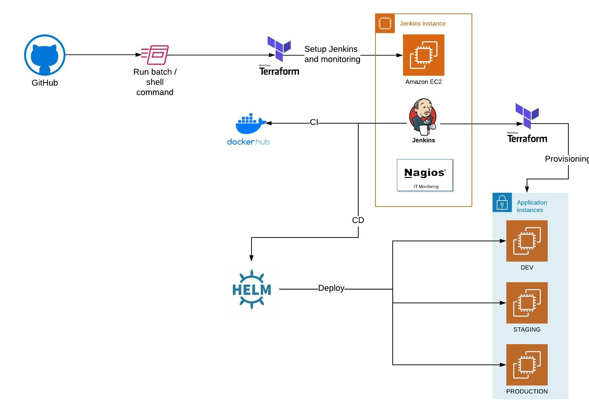

# reach-and-springboot-ci-cd-iac

## HOW TO USE
1. Install following pre-requisites:
   - [packer](https://releases.hashicorp.com/packer/1.7.3/packer_1.7.3_windows_amd64.zip)
   - terraform
   - aws-cli
   - Execute `aws configure` the set the required AWS Access Key ID and AWS Secret Access Key
2. Checkout the code from this github repository
3. Execute `Provision-Jenkins.bat` or `Provision-Jenkins.sh` batch file
4. Add dockerhub login details in Jenkins crediential: registry
5. Update `dockerhub_repository` on line 1 of ci-cd/CI-CD.Jenkinsfile

## ARCHITECTURE

### CI/CD PIPELINE

1. build code base

2. test code base

3. build docker container

4. push docker container

5. deploy application across different environments on target infra (using ansible with ssh)
 
   - deploy to dev environment
   - deploy to staging environment
   - deploy to production environment

### INFRASTRUCTURE PROVISIONING (TERRAFORM)

1. create infrastructure as code for:
   - Jenkins build server (for CI/CD) + Nagios server (for monitoring and auditing)
   - pipeline to provision frontend and backend dev, staging & production EC2 instances on AWS
2. setup access control (to allow multiple personal accounts)

3. add auto scaling to servers (bonus point)

4. mysql/postgresql database (bonus point)
 
5. create destroy functionality

## CLEAN UP / DESTROY
1. Execute `Destroy-Jenkins.bat` or `Destroy-Jenkins.sh` batch file